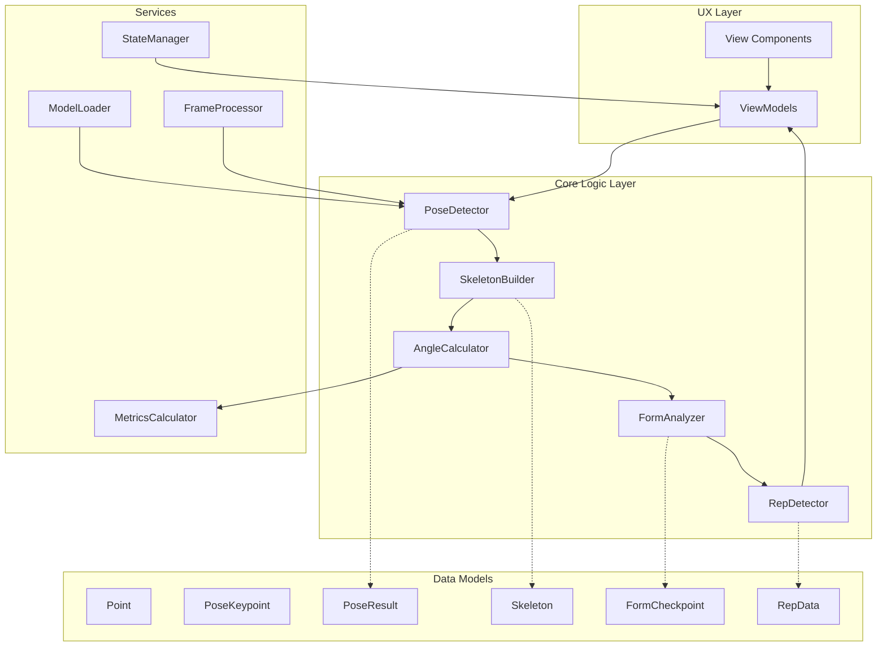
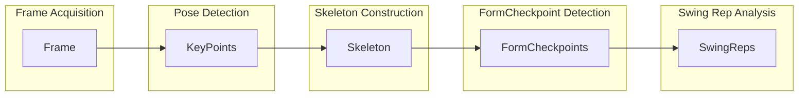

# Swing Analyzer Architecture

This document outlines the architecture of the Swing Analyzer application, showing the different layers and the processing pipeline.

## System Layers

## Processing Pipeline

## UX Layer Details

- **View Components**: UI elements that users interact with directly
  - Camera/Video Input
  - Pose Visualization Overlay
  - Metrics Display
  - Rep Counter Display
- **ViewModels**: Bridge between UI and logic
  - SwingAnalyzerViewModel - manages application state and UI updates
  - FormCheckpointViewModel - presents checkpoints visually

## Processing Pipeline Details

### Pipeline Stages:
1. **Frame Acquisition**
   - Source: Camera or Video
   - Output: Raw image frames

2. **Pose Detection**
   - Input: Raw frames
   - Process: TensorFlow.js/MoveNet model
   - Output: List<KeyPoints> (body keypoints with coordinates)

3. **Skeleton Construction**
   - Input: List<KeyPoints>
   - Process: Connect keypoints, calculate angles
   - Output: Skeleton (connected body parts with derived metrics)

4. **FormCheckpoint Detection**
   - Input: Skeleton + time data
   - Process: Identify specific positions (Top, Hinge, Bottom, Release)
   - Output: FormCheckpoints with timestamps and metrics

5. **Swing Rep Analysis**
   - Input: FormCheckpoints
   - Process: Pattern recognition of complete swing motion
   - Output: SwingReps (counted repetitions with all checkpoints)

## Data Models

- **Point**: Basic x,y,z coordinate
- **PoseKeypoint**: Body keypoint with position and confidence
- **PoseResult**: Complete set of keypoints from a frame
- **Skeleton**: Connected structure of keypoints
- **FormCheckpoint**: Key position in swing with metrics
- **RepData**: Complete repetition with all checkpoints

## Core Logic Layer

- **PoseDetector**: Interface with ML model
- **SkeletonBuilder**: Construct skeleton from keypoints
- **AngleCalculator**: Calculate joint angles
- **FormAnalyzer**: Analyze swing form
- **RepDetector**: Detect and count complete swing repetitions

## Services

- **ModelLoader**: Load and initialize TensorFlow model
- **FrameProcessor**: Process video/camera frames
- **MetricsCalculator**: Calculate swing metrics
- **StateManager**: Manage application state 