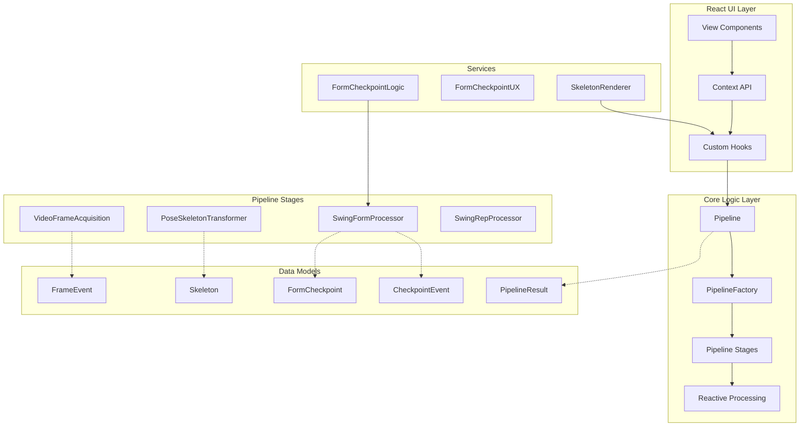

# Swing Analyzer Architecture

This document outlines the architecture of the Swing Analyzer application, showing the different layers and the processing pipeline.

## System Layers

## Reactive Processing Pipeline

```mermaid
flowchart LR
    A[VideoFrameAcquisition] --> |Observable<FrameEvent>| B[PoseSkeletonTransformer]
    B --> |Observable<SkeletonEvent>| C[SwingFormProcessor]
    C --> |Observable<CheckpointEvent>| D[SwingRepProcessor]
    D --> |PipelineResult| E[Custom Hooks & Context]
    E --> |State & Props| F[UI Components]

    subgraph "Frame Acquisition"
        A
    end

    subgraph "Pose Detection & Skeleton Construction"
        B
    end

    subgraph "Form Analysis"
        C
    end

    subgraph "Rep Counting & Analysis"
        D
    end

    subgraph "State Management"
        E
    end

    subgraph "User Interface"
        F
    end
```

## React UI Layer Details

- **View Components**: UI elements that users interact with directly
  - `App.tsx` - Main application component and context provider
  - `VideoSection.tsx` - Video input display and controls
  - `AnalysisSection.tsx` - Analysis results and metrics
  - Camera/Video Input with overlay visualization
  - Checkpoint Grid Display
  - Metrics Display
  - Rep Counter Display
  
- **Context API**: State sharing across components
  - `SwingAnalyzerContext.tsx` - React context for providing shared state to all components
  
- **Custom Hooks**: Encapsulate UI logic and pipeline interaction
  - `useSwingAnalyzer.tsx` - Main hook that manages state, pipeline interactions, and reactive processing

## Pipeline Architecture Details

The swing analyzer uses a reactive pipeline architecture based on RxJS Observables for processing video frames:

### Pipeline Structure:

- **Pipeline**: Orchestrates the entire flow from frame acquisition to rep analysis
- **PipelineFactory**: Creates and configures all pipeline components
- **PipelineInterfaces**: Defines the contract for each processing stage

### Pipeline Stages:

1. **VideoFrameAcquisition (Frame Acquisition)**

   - Source: Camera or Video
   - Output: Observable<FrameEvent> with raw image frames and metadata

2. **PoseSkeletonTransformer (Pose Detection & Skeleton Construction)**

   - Input: FrameEvent
   - Process: TensorFlow.js/MoveNet model for pose detection and skeleton creation
   - Output: Observable<SkeletonEvent> with connected body structure

3. **SwingFormProcessor (Form Analysis)**

   - Input: SkeletonEvent
   - Process: Identify specific positions (Top, Hinge, Bottom, Release)
   - Output: Observable<CheckpointEvent> with form checkpoints

4. **SwingRepProcessor (Rep Counting & Analysis)**
   - Input: CheckpointEvent
   - Process: Pattern recognition of complete swing motion
   - Output: Observable<RepEvent> with rep count and metrics

## Data Models

- **Skeleton**: Connected structure of keypoints and relationships
- **FormCheckpoint**: Key position in swing with metrics
- **PoseResult**: Complete set of keypoints from a frame
- **PipelineResult**: Combined output from the pipeline
- **FrameEvent**, **PoseEvent**, **SkeletonEvent**, **CheckpointEvent**: Event objects for pipeline communication

## Services

- **FormCheckpointLogic**: Business logic for analyzing form checkpoints

  - Implements form checkpoint detection algorithms
  - Analyzes body positions and angles for proper form
  - Determines when key swing positions occur

- **FormCheckpointUX**: UI representation of form checkpoints

  - Renders the visual representation of checkpoints
  - Manages checkpoint grid visualization
  - Handles checkpoint image capturing and display

- **SkeletonRenderer**: Visualization of skeleton and pose data
  - Renders pose skeleton on canvas
  - Draws connections between body keypoints
  - Highlights specific body parts during analysis

## React State Management

- **Application State**: Managed through React hooks (useState, useEffect, useRef)
- **Shared State**: Provided to all components through React Context
- **Reactive State Updates**: State is updated through RxJS pipeline subscriptions
- **Component Organization**: 
  - Provider pattern for global state access
  - Container components for layout and structure
  - Presentation components for UI rendering

## Technology Stack

- **React**: UI framework with hooks and context for state management
- **TypeScript**: Type-safe JavaScript
- **RxJS**: Reactive programming library for asynchronous processing
- **TensorFlow.js**: Machine learning library for pose detection
- **Canvas API**: Visualization of pose and analysis

## Performance Optimizations

- Reactive streaming architecture for efficient frame processing
- Web workers for computation-intensive operations
- Model caching for faster loading
- GPU acceleration through WebGL backend
- React memoization and callback optimization
